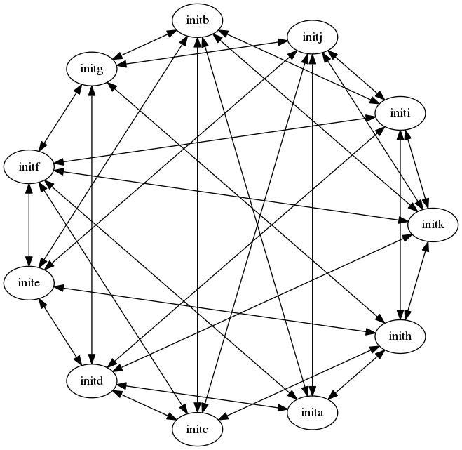
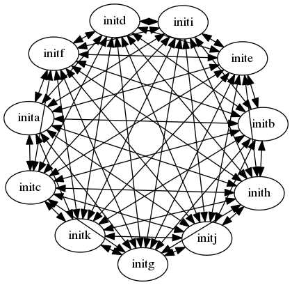

[toc]

#EOS Testnet
  На сегодняшний день вся работа, выполненная для экспериментов с блочной цепью EOS, была выполнена с использованием одного экземпляра eosd-хостинга для всех 21 производителя блоков. Хотя это совершенно правильное решение для проверки функций блочной цепи, разработки новых контрактов и т.д.,но оно не масштабируется. Он также не раскрывает проблемы, возникающие в связи с тем, что данные контрактов и блоков должны делиться между несколькими экземплярами. Предоставление возможности масштабирования предполагает развертывание нескольких узлов eosd для многих хостов и выравнивание в одноранговой сети (p2p). Составление этой сети включает в себя настройку и распространение конфигурационных файлов, координацию запусков и остановок и другие задачи.

Выполнение этого вручную - утомительная задача и легко подверженная ошибкам. К счастью, решение предоставляется в виде приложения Launcher, описанного ниже.

## Testnet nodes, networks, and topology
Прежде чем войти в подробности тестовой системы EOS, давайте проясним некоторые термины. В этом документе я использую термины «хост» и «машина» довольно взаимозаменяемо. Хост обычно сводится к одному IP-адресу, хотя на практике он может иметь больше.

Следующий термин - «узел». Узел представляет собой экземпляр исполняемого файла eosd, сконфигурированный для работы в качестве 0 или более производителей.Между нодами и хостами нет взаимно однозначного сопоставления(one-to-one), хост может обслуживать более одной ноды, но одина нода не может охватывать более одного хоста.

Я использую «локальную сеть» для общения с любой группой узлов, будь то на одном хосте или нескольких, все закрыты тем, что доступ не должен покидать защищенную сетевую среду.

Наконец, есть идея распределенных сетей, которые включают удаленные хосты.Это могут быть хосты, на которых у вас может не быть прямого доступа для запуска и остановки экземпляров eosd, но с которыми вы можете сотрудничать для настройки децентрализованной тестовой сети.

### Localhost networks
Running a testnet on a single machine is the quickest way to get started. As you will see below, this is the default mode for the Launcher application. You can set up a localhost network immediately by simply telling the launcher how many producing or non-producing nodes to activate, and perhaps what type of network topology to use.

The downside is that you need a lot of hardware when running many nodes on a single host. Also the multiple nodes will contend with each other in terms of CPU cycles, limiting true concurrency, and also localhost network performance is much different from inter-host performance, even with very high speed lans.

### Distributed networks
The most representative model of the live net is to spread the eosd nodes across many hosts. The Launcher app is able to start distributed nodes by the use of bash scripts pushed through ssh. In this case additional configuration is required to replace configured references to "localhost" or "127.0.0.1" with the actual host name or ip addresses of the various peer machines.

Launching a distributed testnet requires the operator to have ssh access to all the remote machines configured to authenticate without the need for a user entered password. This configuration is described in detail below. 

In cases where a testnet spans multiple remote networks, a common launcher defined configuration file may be shared externally between distributed operators, each being responsible for launching his or her own local network.

Note that the Launcher will not push instances of eosd to the remote hosts, you must prepare the various test network hosts separately.

### Network Topology
Network topology or "shape" describes how the nodes are connected in order to share transaction and block data, and requests for the same. The idea for varying network topology is that there is a trade off between the number of times a node must send a message reporting a new transaction or block, vs the number of times that message must be repeated to ensure all nodes know of it.

The Launcher has definitions of three different network "shapes" based on inter-nodal connections, which can be selected by a command line option, or you can supply your own network topology by editing the Launcher generated configuration file.

####Ring network

This is the simplest network, where each node identifies just the node next to it as it's only peer. 

####Star network

A "star" is intended to support a larger number of nodes in the testnet. In this case the number of peers connected to a node and the distribution of those nodes varies based on the number of nodes in the network.

####Mesh network

In a "mesh" network, each node is connected to as many peer nodes as possible.

#The Launcher Application
To address the complexity implied by distributing multiple eosd nodes across a LAN or a wider network, the launcher application was created. 

Based on a handful of command line arguments the Launcher is able to compose per-node configuration files, distribute these files securely amongst the peer hosts, then start up the multiple instances of eosd.

Eosd instances started this way have their output logged in individual text files. Finally the launcher application is also able to shut down some or all of the test network. 

##Running the Launcher application

The launcher program is used to configure and deploy producing and non-producing eosd nodes that talk to each other using configured routes. The configuration for each node is stored in separate directories, permitting multiple nodes to be active on the same host, assuming the machine has sufficient memory and disk space for multiple eosd instances. The launcher makes use of multiple configuration sources in order to deploy a testnet. A handful of command line arguments can be used to set up simple local networks. 

To support deploying distributed networks, the launcher will read more detailed configuration from a JSON file. You can use the launcher to create a default JSON file based on the command line options you supply. Edit that file to substitute actual hostnames and other details 
as needed, then rerun the launcher supplying this file.

For the moment the launcher only activates platform-native nodes, dockerized nodes will be added later. It should be straight forward to use the generated configuration files with dockerized nodes.

## Launcher command line arguments
Вот текущий список аргументов командной строки, распознаваемых программой launcher.

```
Testnet launcher options:
  -n [ --nodes ] arg (=1)               общее количество нод для настройки и запуска
  -p [ --pnodes ] arg (=1)              количество нод , которые являются производителями.
  -s [ --shape ] arg (=ring)            топология сети, используйте "ring" "star" 
                                        "mesh" или указать обычное название
  -g [ --genesis ] arg (="./genesis.json")
                                        установить путь к genesis.json
  -o [ --output ] arg                   сохранить копию сгенерированной топологии в этом файле
  --skip-signature                      EOSD не требует транзакции.
   -i [ --timestamp ] arg               установить временную метку для первого блока. 
                                        Используйте "now" для указания текущего времени
  -l [ --launch ] arg                   выберите подмножество нод для запуска. 
                                        В настоящее время может быть "all", "none", или 
                                        "local". Если не установлено, по умолчанию запускает все
                                        если выходной файл назван , в этом случае он не запускает ни одного.
  -k [ --kill ]                         The launcher извлекает ids ранее 
                                        начатых процессов и выпускает sigterm
                                        для каждого.
  -h [ --help ]                         распечатать этот список
```
Заметим, что если testnet.json файл предоставляется как `--shape` аргумент, tтогда `--nodes`, `--pnodes`, и `--genesis` аргументы игнорируются.

## The testnet.json Файл конфигурации

Это файл, созданный при запуске запуска с `--output` аргументом. Объект, описанный в этом файле, состоит из помощника для использования ssl и набора дескрипторов узла тестового узла. Дескрипторы узлов перечислены как пары имени, значения. Обратите внимание, что имена служат двойным назначением, действующим как ключ на карте дескрипторов узлов, так и как псевдоним для узла в списках одноранговых узлов. Пример:

```
{
  "ssh_helper": {
    "ssh_cmd": "/usr/bin/ssh",
    "scp_cmd": "/usr/bin/scp",
    "ssh_identity": "phil",
    "ssh_args": "-i ~phil/.ssh/id-sample"
  },
```
ssh helper поля являются путями к ssh и scp, identity если необходимо, и любые дополнительные аргументы. 
  
```
  "nodes": [[
      "testnet_0",{
        "genesis": "./genesis.json",
        "remote": true,
        "ssh_identity": "",
        "ssh_args": "",
        "eos_root_dir": "/home/phil/blockchain/eos",
        "data_dir": "tn_data_0",
        "hostname": "remoteserv",
        "public_name": "remoteserv",
        "p2p_port": 9876,
        "http_port": 8888,
        "filesize": 8192,
        "keys": [{
            "public_key": "EOS6MRyAjQq8ud7hVNYcfnVPJqcVpscN5So8BhtHuGYqET5GDW5CV",
            "wif_private_key": "5KQwrPbwdL6PhXujxW37FSSQZ1JiwsST4cqQzDeyXtP79zkvFD3"
          }
        ],
        "peers": [
          "testnet_1",
          "testnet_2",
          "testnet_3",
          "testnet_4",
          "testnet_5"
        ],
        "producers": [
          "inita",
          "initg",
          "initm",
          "inits"
        ]
      }
    ],[
      "testnet_1",{

```

Остальная часть testnet.json файла представляет собой набор дескрипторов нод. Фрагмент, показанный выше, был создан с помощью командной строки `programs/launcher/launcher -p6 -s mesh -o testnet.json` и затем отредактирован для ссылки на удаленный хост с именем "remoteserv."

###Elements Of The JSON File
This table describes all of the key/value pairs used in the testnet.json file.

|Value    | Description
|:------------- | :-----------
|ssh_helper | набор значений, используемых для облегчения использования SSH и SCP
nodes | набор дескрипторов, определяющих экземпляры eosd, используемые для сборки этой тестовой сети. Имена, используемые в качестве ключей в этой коллекции, также являются псевдонимами, которые используются в качестве заполнителей для одноранговых нод.


|ssh_helper elements | Description
|:---------- | :------------
ssh_cmd | путь к локальной команде ssh
scp_cmd | путь к локальной команде scp
ssh_args | любые дополнительные аргументы командной строки, необходимые для успешного подключения к удаленным одноранговым серверам
ssh_identity | Имя пользователя, которое будет использоваться при доступе к удаленным хостам

|per-node elements | Description
|:-------- | :----------
genesis | путь к genesis.json файлу. Это должен быть тот же файл для всех членов тестовой сети.
remote | указывает, находится ли этот узел в локальной сети или нет. This flag ties in with the launch mode command line option (-l) to determine if the local launcher instance will attempt to start this node.Этот флаг связан с параметром командной строки режима запуска (-l), чтобы определить, попытается ли экземпляр локальный launcher запустить этот узел.
ssh_identity | переопределение по каждому узлу общего ssh_identity, определенного выше.
ssh_args | переопределение узлов для общих ssh_args
eos_root_dir | определяет каталог, в котором основаны все артефакты eosd. Это необходимо для любых хостов, которые не являются локальным хостом.
data_dir | root для остальных параметров, определенных узлом ниже.
hostname | имя домена для сервера или его IP-адрес.
public_name | возможно, отличается от имени хоста, это имя будет заменено псевдонимами при создании однорангового списка файлов config.ini.
p2p_port | в сочетании с открытым именем, чтобы определить конечную точку, указанную для одноранговых соединений. Когда несколько узлов совместно используют хост, p2p_port автоматически увеличивается для каждого узла.
http_port | определяет конечную точку прослушивания для клиентских API-сервисов
filesize | устанавливает емкость в мегабайтах для размера blockchain backing store файла. 
keys | указивает токены аутентификации для этого узла.
peers | этот список указывает другие узлы в сети, к которым он активно подключается. Поскольку этот файл может быть изменен для изменения значений имени хоста, открытого имени или порта p2p, список одноранговых узлов здесь содержит псевдонимы для фактических конечных точек, которые в конечном итоге записываются в отдельные файлы config.ini.
producers | этот список определяет, какой из производителей из файла genesis.json принадлежит этой ноде. Обратите внимание, что launcher использует алгоритм round-robin для распространения экземпляров производителя через производящие ноды.


###Предоставление распределенных серверов

Секция ssh_helper файла testnet.json содержит элементы ssh, необходимые для подключения и выдачи команд другим серверам.
 В дополнение к разделу ssh_helper, который обеспечивает доступ к глобальным настройкам конфигурации, конфигурация каждой ноды может обеспечивать переопределение аргументов идентификации и подключения.

Также необходимо предоставить серверу, по крайней мере, скопировать исполняемый файл eosd и файлы genesis.json в соответствующие места относительно некоторого имени корневого каталога EOS.
Например, я определил корень EOS `/home/phil/blockchain/eos`.При запуске launcher запускает множество команд оболочки с помощью ssh и, наконец, используя scp для копирования файла config.ini в соответствующий каталог данных на удаленном компьютере.


## Runtime Artifacts
The launcher app creates a separate date and configuration directory for each node instance. This directory is named `tn_data_<n>` with n ranging from 0 to the number of nodes being launched. 

| Per-Node File | Description
| :------------ | :----------
| config.ini  | The eosd configuration file.
| eosd.pid | The process ID of the running eosd instance.
| blockchain/* | The blockchain backing store
| blocks/* | The blockchain log store
| stderr.txt | The cerr output from eosd.
| stdout.txt | The cout output from eosd.

A file called "last_run.json" contains hints for a later instance of the launcher to be able to kill local and remote nodes when run with -k. 

#What Remains To Be Done

Functionality that remains to be implemented: caching signed transactions then purging them on a schedule. Sending summaries of blocks rather than whole blocks. Optimizing the routing between nodes. Failover during new node synchronization if a peer fails to respond timely enough

Also need to prepare tests that are distributed, deterministic, and repeatable.

SOURCE [https://github.com/EOSIO/eos/blob/master/testnet.md]
